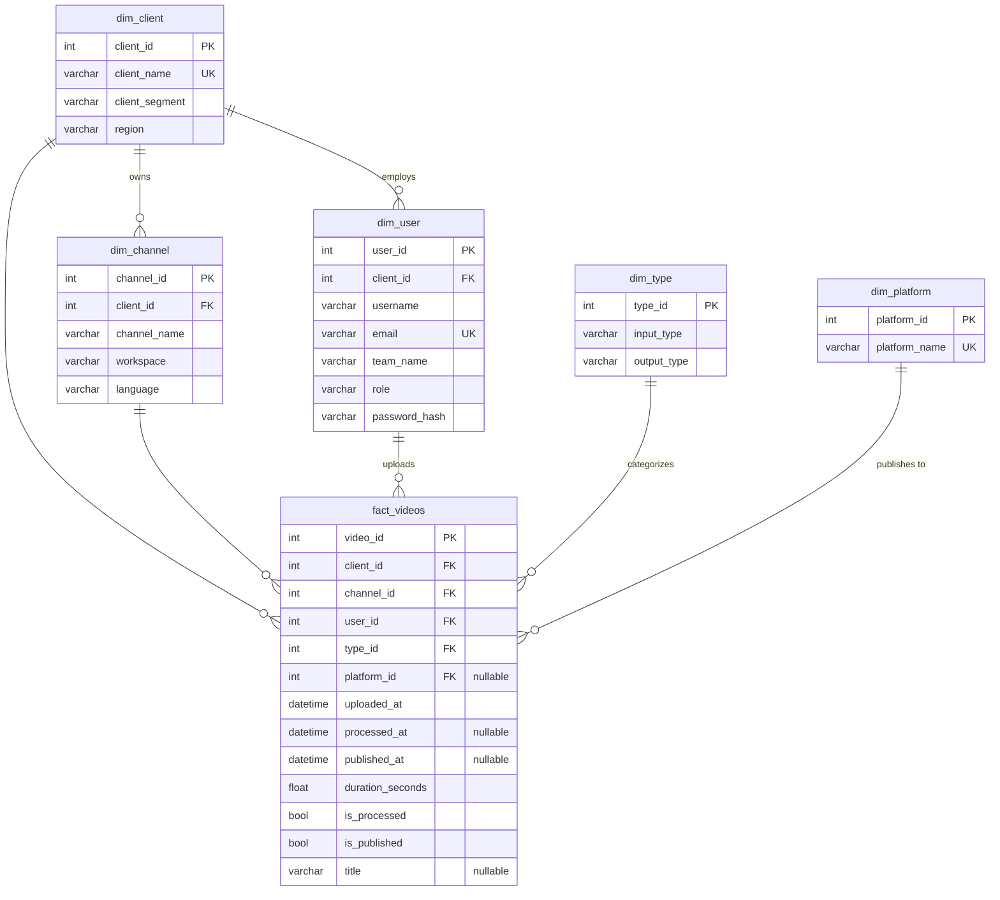

# Data Model — Star Schema

## Overview

Frammer Analytics uses a **star schema** — a denormalized relational design optimized for analytical queries. One central fact table (`fact_videos`) connects to 5 dimension tables via foreign keys.

This design was chosen because:
- **Fast aggregations** — no complex joins needed for most dashboard queries
- **Simple to understand** — business users can reason about the schema
- **Filter-friendly** — each dimension becomes a natural filter axis on the frontend

---

## Entity Relationship Diagram



---

## Fact Table: `fact_videos`

The central table tracking every video's journey through the pipeline.

### Columns

| Column | Type | Nullable | Description |
|--------|------|----------|-------------|
| `video_id` | INTEGER | No (PK) | Auto-incremented unique identifier |
| `client_id` | INTEGER | No (FK) | Which client owns this video |
| `channel_id` | INTEGER | No (FK) | Which channel this video belongs to |
| `user_id` | INTEGER | No (FK) | Who uploaded this video |
| `type_id` | INTEGER | No (FK) | Input/output content type combination |
| `platform_id` | INTEGER | **Yes** (FK) | Where it was published (NULL if unpublished) |
| `uploaded_at` | DATETIME | No | When the video was uploaded |
| `processed_at` | DATETIME | **Yes** | When AI processing completed (NULL if unprocessed) |
| `published_at` | DATETIME | **Yes** | When published to platform (NULL if unpublished) |
| `duration_seconds` | FLOAT | No | Length of the source video in seconds |
| `is_processed` | BOOLEAN | No | Redundant flag for fast filtering |
| `is_published` | BOOLEAN | No | Redundant flag for fast filtering |
| `title` | VARCHAR(255) | **Yes** | Optional video title (NULL for ~5% of records) |

### Indexes

| Index Name | Columns | Purpose |
|-----------|---------|---------|
| `ix_fact_client_uploaded` | `client_id, uploaded_at` | Dashboard queries filtered by client + date |
| `ix_fact_channel_uploaded` | `channel_id, uploaded_at` | Trends page grouped by channel over time |
| `ix_fact_status` | `is_processed, is_published` | Funnel queries filtering on status |
| `ix_fact_uploaded` | `uploaded_at` | Explorer page sorting by upload date |

### Why Redundant Boolean Flags?

`is_processed` and `is_published` are technically redundant — you can derive them from `processed_at IS NOT NULL` and `published_at IS NOT NULL`. But checking a boolean column is significantly faster than checking a timestamp for NULL across 14,000+ rows, especially in aggregation queries like:

```sql
SELECT COUNT(*) FILTER (WHERE is_processed) FROM fact_videos;
-- vs
SELECT COUNT(*) FILTER (WHERE processed_at IS NOT NULL) FROM fact_videos;
```

The boolean version uses a simple integer comparison; the timestamp version requires NULL-checking a larger column type.

---

## Data Volume

| Table | Approximate Rows | Growth Pattern |
|-------|------------------|----------------|
| `dim_client` | 8 | Static (added manually) |
| `dim_channel` | 28 | Grows with clients |
| `dim_user` | 44 | Grows with clients |
| `dim_type` | 31 | Semi-static |
| `dim_platform` | 5 | Semi-static |
| `fact_videos` | ~14,000 | ~80/day average, 180-day range |

---

## Query Patterns

### Scoped Query (Tenant Isolation)

Every dashboard query starts with `scoped_query(db, user)` which applies role-based filtering:

```python
def scoped_query(db, user):
    q = db.query(FactVideos)
    if user.role == "client_admin":
        q = q.filter(FactVideos.client_id == user.client_id)
    elif user.role == "user":
        q = q.filter(FactVideos.user_id == user.user_id)
    return q  # website_admin gets unfiltered
```

### Common Aggregation Pattern

```python
# Single-query aggregation (avoids N+1)
row = q.with_entities(
    func.count(FactVideos.video_id).label("total"),
    func.count().filter(FactVideos.is_processed == True).label("processed"),
    func.count().filter(FactVideos.is_published == True).label("published"),
    func.coalesce(func.sum(FactVideos.duration_seconds), 0).label("duration"),
).one()
```

### Time Series Grouping

```python
# Group by day/week/month
if granularity == "day":
    bucket = cast(FactVideos.uploaded_at, Date)
elif granularity == "week":
    bucket = func.date_trunc("week", FactVideos.uploaded_at)
elif granularity == "month":
    bucket = func.date_trunc("month", FactVideos.uploaded_at)
```
