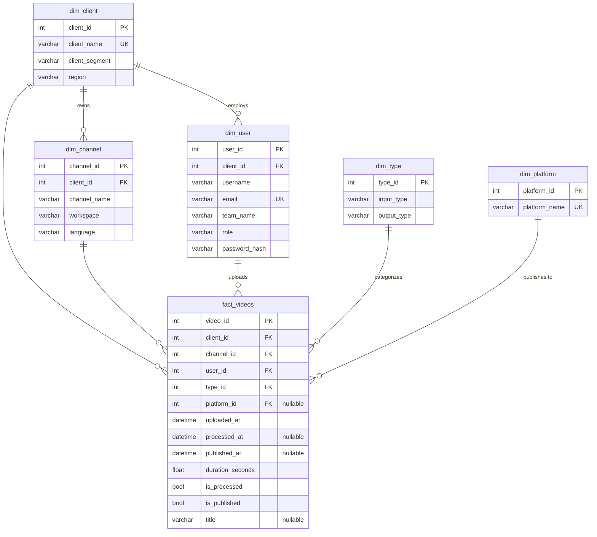

# Data Model

> How the database is structured and why we made the choices we did.

## Why a Star Schema?

We went with a classic star schema — one big fact table in the middle, surrounded by smaller dimension tables. It's the standard pattern for analytics databases and it made sense here because:

1. **Most of our queries are aggregations.** Things like "how many videos did TechVista upload last week?" or "what's the processing rate for Short Clips?" These are `COUNT` / `SUM` / `GROUP BY` queries that work perfectly with a single denormalized fact table.

2. **The dashboard needs to filter by any dimension.** The global filter bar lets users pick a client, channel, or platform and every chart updates. With a star schema, that's just adding a `WHERE client_id = ?` to every query — no complex joins required.

3. **It's easy to explain.** When someone new looks at the schema, they immediately get it: "oh, there's a table of videos and a bunch of lookup tables for who/what/where."

---

## ER Diagram



---

## The Fact Table (`fact_videos`)

This is where all the action is. Every row represents one video that entered the Frammer pipeline. Currently holds ~14,000 records spanning 180 days.

| Column | Type | Nullable? | What it tracks |
|--------|------|-----------|----------------|
| `video_id` | int | No (PK) | Unique video identifier |
| `client_id` | int | No (FK) | Which company uploaded it |
| `channel_id` | int | No (FK) | Which channel it belongs to |
| `user_id` | int | No (FK) | Who uploaded it |
| `type_id` | int | No (FK) | What kind of content transformation |
| `platform_id` | int | **Yes** (FK) | Where it was published — NULL means unpublished |
| `uploaded_at` | datetime | No | When it entered the system |
| `processed_at` | datetime | **Yes** | When AI processing finished — NULL means unprocessed |
| `published_at` | datetime | **Yes** | When it went live — NULL means unpublished |
| `duration_seconds` | float | No | Length of the source video |
| `is_processed` | bool | No | Quick flag: has processing completed? |
| `is_published` | bool | No | Quick flag: has it been published? |
| `title` | varchar(255) | **Yes** | Video title — intentionally NULL for ~5% of records (simulated data quality issue) |

### About the boolean flags

You might look at `is_processed` and think "wait, can't you just check `processed_at IS NOT NULL`?" And you'd be right — they're redundant. But we keep them because:

- **They're faster to filter on.** A boolean column comparison is cheaper than a NULL check on a datetime, especially when you're doing `COUNT(*) FILTER (WHERE is_processed)` across 14K rows.
- **They make the queries more readable.** `WHERE is_published = true` is clearer than `WHERE published_at IS NOT NULL` when you're scanning through route code.
- **The data simulator sets them consistently.** If `processed_at` is set, `is_processed` is always `true`. They never drift.

In a production system with millions of rows, this kind of denormalization saves real query time.

---

## Indexes

We added a few composite indexes to speed up the most common dashboard queries:

| Index | Columns | Which queries it helps |
|-------|---------|----------------------|
| `ix_fact_client_uploaded` | `client_id, uploaded_at` | Anything filtered by client + date range (most dashboard queries) |
| `ix_fact_channel_uploaded` | `channel_id, uploaded_at` | Trends page grouped by channel over time |
| `ix_fact_status` | `is_processed, is_published` | Funnel stage counts |
| `ix_fact_uploaded` | `uploaded_at` | Explorer page sorting by upload date |

These aren't measured with EXPLAIN ANALYZE yet (we should do that). They're based on the actual query patterns in our route handlers.

---

## How Queries Work

### Tenant Isolation

Every single dashboard query goes through `scoped_query()` first. This function looks at who's logged in and automatically adds a `WHERE` clause:

```python
def scoped_query(db, user):
    q = db.query(FactVideos)
    if user.role == "client_admin":
        q = q.filter(FactVideos.client_id == user.client_id)
    elif user.role == "user":
        q = q.filter(FactVideos.user_id == user.user_id)
    return q  # website_admin gets everything
```

This way, tenant isolation happens in one place. Individual route handlers never need to think about access control — they just call `scoped_query()` and stack on additional filters.

### Single-Query Aggregation

We try to avoid the N+1 pattern. Instead of making 4 separate `COUNT(*)` queries for the Executive Summary KPIs, we compute everything in one shot:

```python
row = q.with_entities(
    func.count(FactVideos.video_id).label("total"),
    func.count().filter(FactVideos.is_processed == True).label("processed"),
    func.count().filter(FactVideos.is_published == True).label("published"),
    func.coalesce(func.sum(FactVideos.duration_seconds), 0).label("duration"),
).one()
```

One database round trip, four metrics. The `func.count().filter(...)` syntax is SQLAlchemy's equivalent of PostgreSQL's `COUNT(*) FILTER (WHERE ...)`.

### Time Series Bucketing

For the Trends page, we group uploads into day/week/month buckets:

```python
if granularity == "day":
    bucket = cast(FactVideos.uploaded_at, Date)
elif granularity == "week":
    bucket = func.date_trunc("week", FactVideos.uploaded_at)
elif granularity == "month":
    bucket = func.date_trunc("month", FactVideos.uploaded_at)
```

The `date_trunc` function is PostgreSQL-specific. If we ever needed to support SQLite for testing, we'd need to swap this out.

---

## Data Volume

| Table | Rows | How it grows |
|-------|------|-------------|
| dim_client | 8 | Manually — new clients are rare |
| dim_channel | 28 | When clients add new content streams |
| dim_user | 44 | When clients add new team members |
| dim_type | 31 | Semi-static — new content types are rare |
| dim_platform | 5 | Semi-static (maybe Threads someday?) |
| fact_videos | ~14,000 | ~80/day on average, spread across all clients |

The simulator generates data over a 180-day window with realistic patterns: weekday volume is higher than weekends, enterprise clients produce more content, and processing/publishing has intentional failure rates (~15% never processed, ~45% never published).
