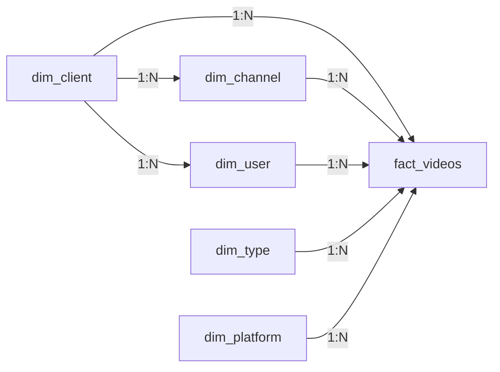

# Dimension Dictionary

All dimension tables in the Frammer Analytics star schema, their attributes, hierarchies, and relationships.

---

## dim_client

Represents enterprise customers who use the Frammer platform.

| Column | Type | Nullable | Description |
|--------|------|----------|-------------|
| `client_id` | INTEGER (PK) | No | Auto-incremented unique identifier |
| `client_name` | VARCHAR(100) | No | Company name (unique) |
| `client_segment` | VARCHAR(50) | No | Business tier: `enterprise`, `mid-market`, `startup` |
| `region` | VARCHAR(50) | No | Geographic region: `North America`, `Europe`, `Asia Pacific`, `Latin America` |

### Hierarchy
```
region → client_segment → client_name
```

### Sample Data
| client_name | segment | region |
|------------|---------|--------|
| TechVista Corp | enterprise | North America |
| MediaFlow Global | enterprise | Europe |
| ContentScale Inc | mid-market | North America |
| CloudCut Digital | mid-market | Asia Pacific |
| PixelWave Media | startup | North America |

### Relationships
- **One-to-many** → `dim_channel` (a client owns multiple channels)
- **One-to-many** → `dim_user` (a client has multiple users)
- **One-to-many** → `fact_videos` (a client's videos)

---

## dim_channel

Represents content channels within a client organization. Think YouTube channels, podcast feeds, or internal content streams.

| Column | Type | Nullable | Description |
|--------|------|----------|-------------|
| `channel_id` | INTEGER (PK) | No | Auto-incremented unique identifier |
| `client_id` | INTEGER (FK) | No | Parent client |
| `channel_name` | VARCHAR(150) | No | Channel display name |
| `workspace` | VARCHAR(100) | No | Team/department that owns this channel |
| `language` | VARCHAR(50) | No | Primary content language |

### Hierarchy
```
client → workspace → channel_name
```

### Languages
`English`, `Spanish`, `French`, `German`, `Japanese`, `Portuguese`, `Hindi`

### Relationships
- **Many-to-one** → `dim_client` (a channel belongs to one client)
- **One-to-many** → `fact_videos` (a channel contains multiple videos)

---

## dim_user

Represents individual users who upload and manage videos on the platform.

| Column | Type | Nullable | Description |
|--------|------|----------|-------------|
| `user_id` | INTEGER (PK) | No | Auto-incremented unique identifier |
| `client_id` | INTEGER (FK) | No | Parent client |
| `username` | VARCHAR(100) | No | Display name |
| `email` | VARCHAR(150) | No | Login email (unique) |
| `team_name` | VARCHAR(100) | No | Team within the client org |
| `role` | VARCHAR(30) | No | Access level: `website_admin`, `client_admin`, `user` |
| `password_hash` | VARCHAR(255) | No | bcrypt-hashed password |

### Roles & Permissions

| Role | Can See | Description |
|------|---------|-------------|
| `website_admin` | All data | Platform operator, sees all clients |
| `client_admin` | Own client's data | Client-level manager |
| `user` | Own uploads only | Individual content creator |

### Hierarchy
```
role → client → team_name → username
```

### Relationships
- **Many-to-one** → `dim_client` (a user belongs to one client)
- **One-to-many** → `fact_videos` (a user uploads multiple videos)

---

## dim_type

Represents the content transformation pipeline — what goes in (input) and what comes out (output).

| Column | Type | Nullable | Description |
|--------|------|----------|-------------|
| `type_id` | INTEGER (PK) | No | Auto-incremented unique identifier |
| `input_type` | VARCHAR(80) | No | Source content format |
| `output_type` | VARCHAR(80) | No | Generated content format |

### Input Types
`Webinar`, `Podcast`, `Interview`, `Presentation`, `Meeting Recording`, `Tutorial`, `Lecture`, `Panel Discussion`, `Product Demo`

### Output Types
`Short Clip`, `Highlights Reel`, `Chapter`, `Summary`, `Quote Card`, `Tutorial`, `Trailer`

### Hierarchy
```
input_type → output_type
```

### Relationships
- **One-to-many** → `fact_videos` (a type combination is used by many videos)

---

## dim_platform

Represents publishing destinations where processed videos are distributed.

| Column | Type | Nullable | Description |
|--------|------|----------|-------------|
| `platform_id` | INTEGER (PK) | No | Auto-incremented unique identifier |
| `platform_name` | VARCHAR(80) | No | Platform name (unique) |

### Available Platforms
`YouTube`, `Instagram`, `TikTok`, `LinkedIn`, `Twitter/X`

### Relationships
- **One-to-many** → `fact_videos` (a platform receives many published videos)

> **Note:** `platform_id` in `fact_videos` is **nullable**. A NULL platform means the video has not been published yet.

---

## Dimension Cross-References



### Filter Scoping
When a user selects a **Client** in the global filter bar, the **Channel** dropdown automatically scopes to only show channels belonging to that client. This is implemented client-side by filtering `filterOptions.channels` where `channel.client_id === selectedClientId`.
